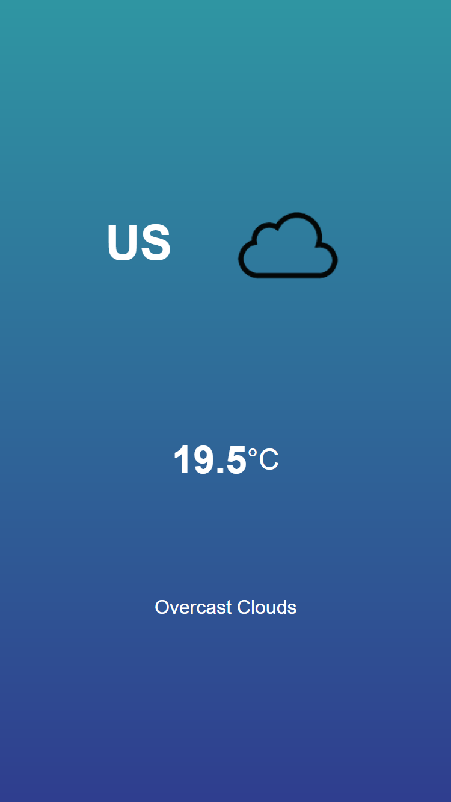

# My First Weather App

This mini project taught me how to use API. 

## Table of contents

- [Overview](#overview)
  - [The challenge](#the-challenge)
  - [Screenshot](#screenshot)
  - [Links](#links)
- [My process](#my-process)
  - [Built with](#built-with)
  - [What I learned](#what-i-learned)

## Overview

### The challenge

Users should be able to:

- Get weather status based on their location
- Toggle different scales of temperature

### Screenshot



### Links

- Live Site URL: https://pyaethein.github.io/Weather-App/

## My process

### Built with

- Semantic HTML5 markup
- CSS custom properties
- Flexbox
- SASS
- Vanilla JavaScript

### What I learned

- fetching api

```js
const api = `https://api.openweathermap.org/data/2.5/weather?lat=${lat}&lon=${long}&appid=960c95e56dc11e6dcb7dc3cc2a9f09fe&units=metric`;

fetch(api)
  .then(response => {
    return response.json();
  })
  .then(data => {
    console.log(data);
  })
```